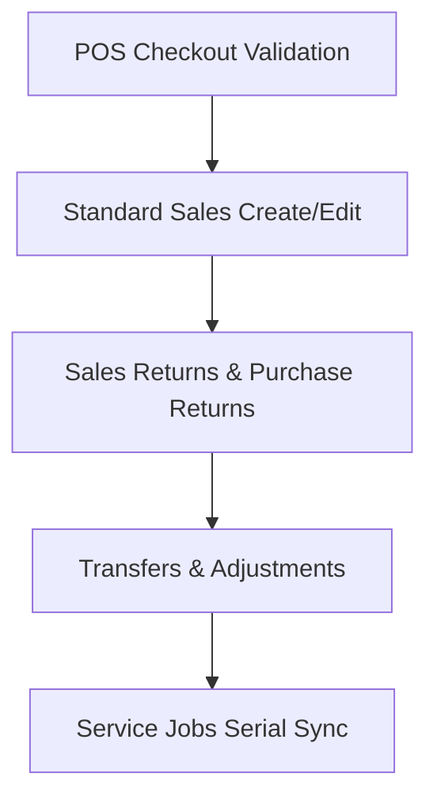

# Product Serial Number Tracking Roadmap & Handover Guide

This document provides a comprehensive overview of the **Serial Number Tracking** implementation for the Stoky inventory management system. It serves as a detailed guide for any future AI agent or developer to complete the remaining tasks.

---

## 1. Overall Feature Objective
The goal is to implement unique serial number (or IMEI) tracking for products that have `enable_serial_tracking = true`. 
Unlike general inventory quantity tracking, each unit of a serial-tracked product must have a specific, unique string (serial number) assigned to it.
* **On Purchase (Stock In):** Users must input exactly $N$ serial numbers (one per line or comma-separated) matching the purchase quantity. These are saved to `product_serial_numbers` as `available` in the selected warehouse.
* **On Sale/POS (Stock Out):** Users must select or enter exactly $N$ existing `available` serial numbers from that warehouse. The serials are marked as `sold`.
* **On Transfer (Warehouse shift):** Users select $N$ serials that are currently `available` at the source warehouse, and they are updated to the target warehouse location.
* **On Returns (Purchase Return / Sale Return):** Serials are tracked back or released back into/from availability.
* **On Adjustment:** Damaged/lost serials are marked accordingly.
* **On Service Jobs:** Selected serials are consumed for repairs.

---

## 2. Current Implementation Status

### A. Database Schema & Models
* **Migration:** `database/migrations/2026_06_04_061430_create_product_serial_tracking_tables.php`
  * Added `enable_serial_tracking` boolean column to the `products` table.
  * Created `product_serial_numbers` table (tracks serials, statuses like `available`, `sold`, location ID, customer ID, purchase line ID, sell line ID, etc.).
  * Created `serial_number_histories` table for audit logging.
* **Backend Service:** `app/Services/SerialTrackingService.php`
  * Contains methods for validating and applying serial number transitions for purchases, sales, transfers, returns, adjustments, and service jobs.
  * Handles DB transactions and prevents mismatched counts on save.

### B. Completed Modules
* **Purchases (Backend & Frontend):**
  * **Backend:** Integrated in `PurchasesController.php` (store, update, delete, bulk delete).
  * **Frontend:** Fully implemented in `resources/src/views/app/pages/purchases/create_purchase.vue` and `resources/src/views/app/pages/purchases/edit_purchase.vue`. Textareas with real-time length matching quantity validation, warning banners, and submit blocking are configured.

* **POS Frontend (Partial):**
  * Variables `enable_serial_tracking` and `serial_numbers` mapped.
  * Cart panel added showing a text area to scan or input serials.
  * Detail update modal modified to accept serials.

---

## 3. Remaining Tasks & Scope

Here are the remaining sections that need frontend and backend integration:



### Task 1: Complete POS Validation & Checkout Flow (`pos.vue`)
* **File:** `/var/www/html/stoky/resources/src/views/app/pages/pos.vue`
* **Status:** Cart inputs exist, but submit validation and loading warehouse-available serials need to be wired.
* **Goal:** 
  1. For sales, serial numbers should be validated against existing `available` serial numbers in that warehouse.
  2. Implement validation before allowing POS checkout: if a product is serial-tracked, ensure `serial_numbers` count equals `quantity`.

### Task 2: Standard Sales Module (`create_sale.vue` and `edit_sale.vue`)
* **Files:** 
  * `/var/www/html/stoky/resources/src/views/app/pages/sales/create_sale.vue`
  * `/var/www/html/stoky/resources/src/views/app/pages/sales/edit_sale.vue`
* **Goal:**
  * Add a textarea or select list in the items table for serial numbers when a product has `enable_serial_tracking` enabled.
  * Add computed validations on submit: block submission if the serial count does not match the item quantity.
  * For editing, fetch currently associated serial numbers for the sale details and populate the form fields.

### Task 3: Transfers Module (`create_transfer.vue` and `edit_transfer.vue`)
* **Files:**
  * `/var/www/html/stoky/resources/src/views/app/pages/transfers/create_transfer.vue`
  * `/var/www/html/stoky/resources/src/views/app/pages/transfers/edit_transfer.vue`
* **Goal:**
  * When transferring serial-tracked items, display a validation input for serials.
  * Ensure the serial numbers selected are `available` at the source warehouse.
  * Submit the serials to the backend API (`transfers/store` and `transfers/update`).

### Task 4: Adjustments Module (`Create_Adjustment.vue` and `Edit_Adjustment.vue`)
* **Files:**
  * `/var/www/html/stoky/resources/src/views/app/pages/adjustment/Create_Adjustment.vue`
  * `/var/www/html/stoky/resources/src/views/app/pages/adjustment/Edit_Adjustment.vue`
* **Goal:**
  * Track adjustments per serial number. If subtracting stock, the specific serial numbers must be entered/selected.

### Task 5: Sales Returns and Purchase Returns
* **Files:**
  * `/var/www/html/stoky/resources/src/views/app/pages/sale_return/...`
  * `/var/www/html/stoky/resources/src/views/app/pages/purchase_return/...`
* **Goal:**
  * Record serials being returned by customers or returned to suppliers.

---

## 4. Implementation Guide for AI Agent

When you start implementing the tasks above, follow this architecture:

### Step A: Fetching Available Serial Numbers (Frontend API Call)
For any module that sells, transfers, or adjusts items (i.e. where items must already exist in stock), you should fetch the list of available serials from the warehouse:
1. Create a lightweight endpoint or use a controller action:
   ```php
   // Example Route in api.php or a controller method:
   public function getAvailableSerials(Request $request) {
       $product_id = $request->product_id;
       $warehouse_id = $request->warehouse_id;
       
       $serials = ProductSerialNumber::where('product_id', $product_id)
           ->where('current_location_id', $warehouse_id)
           ->where('status', 'available')
           ->pluck('serial_no');
           
       return response()->json($serials);
   }
   ```
2. In Vue components, call this endpoint when a serial-tracked product is added or when the warehouse changes.

### Step B: Vue UI Component for Serial Input
Use a template format similar to the one implemented in `create_purchase.vue`:
```vue
<tr v-if="detail.enable_serial_tracking && detail.no_unit !== 0" :key="'serials-'+detail.detail_id">
  <td colspan="9" class="p-3">
    <div class="serial-tracking-container bg-light border-left-success p-3 rounded">
      <h6 class="text-success font-weight-bold">
        <i class="i-Check"></i> Serial/IMEI Numbers ({{ detail.serial_numbers.length }} / {{ detail.quantity }})
      </h6>
      <b-form-textarea
        rows="2"
        :value="detail.serial_numbers.join('\n')"
        @input="val => onSerialInput(detail, val)"
        placeholder="Enter or scan serial numbers (one per line or comma-separated)"
      />
      <div v-if="detail.serial_numbers.length !== Math.floor(detail.quantity)" class="text-danger mt-1">
        Serial count must match item quantity exactly.
      </div>
    </div>
  </td>
</tr>
```

### Step C: Submit validation block
Verify that the submit button is disabled or intercepted with a warning toast when validation fails:
```javascript
// Computed property
hasSerialValidationErrors() {
  return this.details.some(d => {
    if (!d.enable_serial_tracking) return false;
    return d.serial_numbers.length !== Math.floor(d.quantity);
  });
}
```

### Step D: Backend Database Integration
Inside the controller (e.g. `SalesController.php`), import the service:
```php
use App\Services\SerialTrackingService;

// Inside store() / update():
$serialService = app(SerialTrackingService::class);

// First Validate:
$validation = $serialService->validateSale($detailsArray, $warehouseId);
if (!$validation['success']) {
    return response()->json(['message' => $validation['message']], 422);
}

// Then Apply inside the DB transaction:
$serialService->applyForSale($saleDetailModel, $serialNumbersArray);
```

Check the existing code in `PurchasesController.php` (around lines 200-330) and `app/Services/SerialTrackingService.php` to replicate exact validation patterns.
